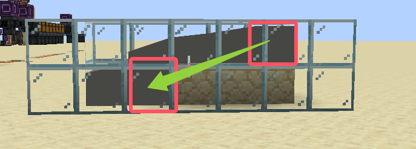

---
navigation:
  title: "Cement"
  icon: "anvilcraft:gray_cement_bucket"
items:
  - anvilcraft:white_cement_bucket
  - anvilcraft:light_gray_cement_bucket
  - anvilcraft:gray_cement_bucket
  - anvilcraft:black_cement_bucket
  - anvilcraft:brown_cement_bucket
  - anvilcraft:red_cement_bucket
  - anvilcraft:orange_cement_bucket
  - anvilcraft:yellow_cement_bucket
  - anvilcraft:lime_cement_bucket
  - anvilcraft:green_cement_bucket
  - anvilcraft:cyan_cement_bucket
  - anvilcraft:light_blue_cement_bucket
  - anvilcraft:blue_cement_bucket
  - anvilcraft:purple_cement_bucket
  - anvilcraft:magenta_cement_bucket
  - anvilcraft:pink_cement_bucket
---

# Cement

<row halign="center">
<item id="anvilcraft:gray_cement_bucket"/>
</row>

# Acquisition

<recipe id="anvilcraft:solid_liquid/cement_cauldron"/>
- The cement produced is gray by default; throw dye into the cauldron and crush to change the color

# Function

- Can be used to [craft Concrete](../008_recipe/005_concrete.md)

# Transfer

- Cement behaves more like a real liquid: its source slowly **transfers** downward to a random position
- Sources in contact with <ref item="minecraft:slime_block"/> or <ref item="minecraft:honey_block"/> will not **transfer**

# Solidification

- When a cement source cannot move down, it has a chance to **solidify** into Concrete together with the flowing cement in the first and second rings around it
- Sources in contact with <ref item="anvilcraft:sugar_block"/> or <ref item="minecraft:honey_block"/> will not **solidify**
