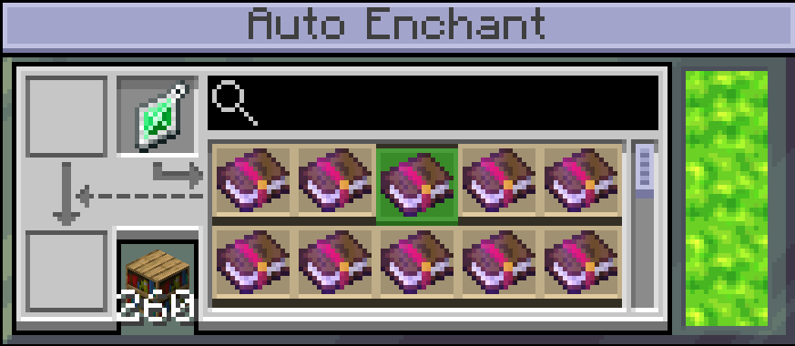
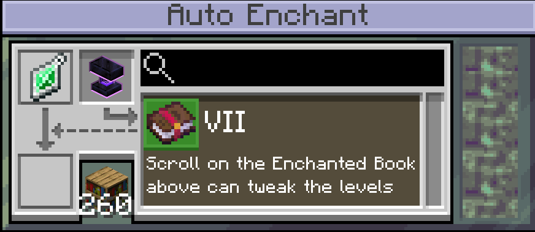

---
navigation:
  title: "§6Auto Enchanting Table"
  icon: "anvilcraft:auto_enchanting_table"
items:
  - anvilcraft:auto_enchanting_table
---

# <ref item="anvilcraft:auto_enchanting_table"/>

> Automates all kinds of enchanting work

<row halign="center">
<recipe id="anvilcraft:auto_enchanting_table"/>
</row>

# Random Enchanting

- Consumes 16 kW continuously and will not work without sufficient power
- Counts the enchant power provided by <ref item="minecraft:bookshelf"/> within <ref item="minecraft:enchanting_table"/> detection range (other blocks that provide enchant power also count), up to level 15
- After placing an item, each random enchantment consumes n * 400 mB of [Liquid Experience](../002_material/004_exp_gem.md#experience-fluid) based on the enchant power n and takes 4 seconds to complete

# Directed Enchanting

Place an <ref item="anvilcraft:emerald_amulet"/>

- Consumes 64 kW continuously and will not work without sufficient power
- Counts the enchant power provided by <ref item="minecraft:bookshelf"/> within <ref item="minecraft:enchanting_table"/> detection range (other blocks that provide enchant power also count), with no upper limit
- Freely select any enchantment obtainable from villager trading; multiple selections are allowed, with count and level limited by *enchant power*
- After placing an item and **closing the selection GUI**, each directed enchantment consumes n * 400 mB of [Liquid Experience](../002_material/004_exp_gem.md#experience-fluid) based on the enchant power n and takes 4 seconds to complete

<tip>
Only enchantments compatible with the item can be applied, for example you cannot apply Efficiency to a *Sword*
</tip>

# Enchanting with Liquid Enchantment

Put in [Liquid Enchantment](../002_material/210_liquid_enchantment.md) **instead of** [Liquid Experience](../002_material/004_exp_gem.md#experience-fluid)

- Consumes 64 kW continuously and will not work without sufficient power
- Consumes *Liquid Enchantment* to enchant items; the cost scales with the enchantment level: level 1 costs 1 mB, level 2 costs 2 mB, level 3 costs 4 mB, level 4 costs 8 mB, level 5 costs 16 mB, and so on
- Enchant power is no longer required
- Placing an <ref item="anvilcraft:ember_anvil"/> or <ref item="anvilcraft:transcendence_anvil"/> unlocks the following abilities:
  - Forcibly apply mutually incompatible enchantments to an item
  - Enchantment levels can exceed the level cap
- If the item already has enchantments, power consumption increases by n * 64 kW, where n is the number of enchantment types on the item
