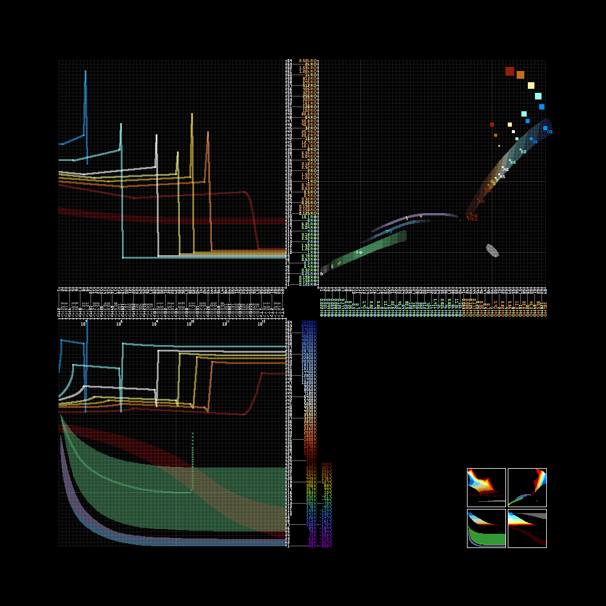

---
navigation:
  title: "§5Celestial Forging Anvil"
  icon: "anvilcraft:celestial_forging_anvil"
items:
  - anvilcraft:celestial_forging_anvil
  - anvilcraft:celestial_forging_anvil_amplifier
  - anvilcraft:celestial_forging_anvil_logistics_interface
  - anvilcraft:celestial_forging_anvil_fluid_interface
  - anvilcraft:celestial_forging_anvil_laser_interface
---

# <ref item="anvilcraft:celestial_forging_anvil"/>

<item id="anvilcraft:celestial_forging_anvil"/>

- Obtained through [Multi-block Crafting](210_giant_anvil.md#2-multi-block-crafting)
- Requires 3x2x3 space to place
- Can remotely bind to a celestial body in the universe to obtain resources

# Adjusting Celestial Parameters

Open the GUI of <ref item="anvilcraft:celestial_forging_anvil"/>. On the left side, you can place any number of the four basic anvils, which determine the four parameters of the celestial body.

|                      Anvil                       |  Parameter   | Base Value per Anvil |               Growth Trend               |
|:------------------------------------------------:|:------------:|:--------------------:|:----------------------------------------:|
|  <ref item="anvilcraft:confined_time_anvilon"/>  |     Age      |         2My          |    Doubles every 3 additional anvils     |
| <ref item="anvilcraft:confined_space_anvilon"/>  |    Radius    |       0.125R⊕        |    Doubles every 3 additional anvils     |
|  <ref item="anvilcraft:confined_mass_anvilon"/>  |     Mass     |       0.022M⊕        |    Doubles every 2 additional anvils     |
| <ref item="anvilcraft:confined_energy_anvilon"/> | Surface Temp |         50K          | Kelvin doubles every 6 additional anvils |

> The following can be skipped

<info>
**Astronomical Units**
1. Time: My (10^6 years, million years), By (10^9 years, billion years), Ty (10^12 years, trillion years)
2. Length: R⊕ (times Earth radius), R☉ (times Solar radius)
3. Mass: M⊕ (times Earth mass), M☉ (times Solar mass)
4. Temperature: ℃ (Celsius), K (Kelvin); ℃ ≈ K-273, 0℃ = 273K, 100℃ = 373K
</info>

# Binding a Star

- Relying only on <ref item="anvilcraft:celestial_forging_anvil"/> can only bind planets
- To bind a star, you need to craft and place <ref item="anvilcraft:celestial_forging_anvil_amplifier"/>

<recipe id="anvilcraft:item_inject/celestial_forging_anvil_amplifier"/>

> Crafting requires <ref item="anvilcraft:spacetime_supercomputer"/>

<structure id="../../structures/forging_stars.nbt"/>

After building the correct structure, <ref item="anvilcraft:celestial_forging_anvil"/> enters *Amplified State*

# Binding a Celestial Body

1. Only specific combinations of celestial parameters can bind to the corresponding celestial body
2. If the parameter combination is correct, after 10s of searching, a celestial body can be bound
3. Repeated searching will bind to the same type of celestial body, but the specific material composition will change

## Search Energy Consumption

- During the search, <ref item="anvilcraft:celestial_forging_anvil"/> consumes power
- Default continuous power consumption is 1MW (=1024kW)
- In *Amplified State*, power consumption is 4MW

## Determining Celestial Body Type

1. The left, top, right, and bottom axes represent the four parameters of the celestial body
2. The parameter groups form 3 focal points at the top-left, top-right, and bottom
3. If the three focal points are exactly the same color, the parameters are valid and the celestial body can be bound

# Extracting Celestial Resources

1. After successfully binding a celestial body
2. Click the bind button at the bottom of the <ref item="anvilcraft:celestial_forging_anvil"/> GUI
3. On the right side of the <ref item="anvilcraft:celestial_forging_anvil"/> GUI, select *Mega Structure* and submit the corresponding **building materials**
4. Input raw materials through various interfaces, then extract resources

<tip>
To remove a mega structure, simply unbind and rebind the planet
</tip>

## Using Interfaces

### <ref item="anvilcraft:celestial_forging_anvil_logistics_interface"/>

<recipe id="anvilcraft:celestial_forging_anvil_logistics_interface"/>

- Can hold 16 types of items, each up to 1 stack

### <ref item="anvilcraft:celestial_forging_anvil_fluid_interface"/>

<recipe id="anvilcraft:celestial_forging_anvil_fluid_interface"/>

- Can hold 4 types of fluids, each up to 80 buckets
- **Continuous power consumption** 128kW

### <ref item="anvilcraft:celestial_forging_anvil_laser_interface"/>

<row halign="center">
<recipe id="anvilcraft:celestial_forging_anvil_laser_interface"/>
<recipe id="anvilcraft:celestial_forging_anvil_laser_interface_from_large_laser"/>
</row>

- Receives lasers
- Receives redstone signal to switch to attempting laser emission

## Maintaining Mega Structures

- Different mega structures have different construction conditions, requiring specific types of planets
- Some mega structures require input of items, fluids, lasers, or power — the first three need to be input through *interfaces*
- Some mega structures can produce items, fluids, lasers, or power — the first three need to be output through *interfaces*

## Obtaining Resources

- Normally, if there are multiple <ref item="anvilcraft:celestial_forging_anvil_logistics_interface"/>, they output in rotation, with a total of 20 items per second
- Normally, each <ref item="anvilcraft:celestial_forging_anvil_logistics_interface"/> independently outputs 5B (buckets) of fluid per second

## Planetary Mega Structures

- Can be built when not in *Amplified State*
- Generally only one mega structure can be built at a time

|     Mega Structure     |            Construction Condition            |                   Input                    |                Output                |
|:----------------------:|:--------------------------------------------:|:------------------------------------------:|:------------------------------------:|
|  Planetary Excavator   |        Large satellite, rocky planet         | Level 16 [Laser](201_basic_laser.md#laser) |           Items (minerals)           |
|  Planetary Extractor   |         Rocky planet with **liquid**         |                    None                    |     Fluid (planetary resources)      |
|      Eco Station       |  Rocky planet with **biological resources**  |                 Power 1MW                  | Items & Fluid (biological resources) |
|         Temple         | Rocky planet with **low-level civilization** |               Specific items               |          Items (offerings)           |
| Giant Planet Extractor |             Gas giant, ice giant             |                    None                    | Items & Fluid (planetary resources)  |

<info>
For *Planetary Excavator*, at most 4 <ref item="anvilcraft:celestial_forging_anvil_laser_interface"/> can receive input this way, granting up to 4x collection efficiency
Note that even with a level 64 laser input into one interface, it still counts as 1x efficiency
</info>

<info>
*Temple* inputs are items as divine blessings or punishments to maintain the faith of low-level civilizations. Item requirements are updated every MC day (cycling in the order of two blessings followed by one punishment)
</info>

## Stellar Mega Structures

- Can be built when in *Amplified State*
- Generally only one mega structure can be built at a time

|   Mega Structure    |  Construction Condition  |     Input     |                                                                                                             Output/Effect                                                                                                             |
|:-------------------:|:------------------------:|:-------------:|:-------------------------------------------------------------------------------------------------------------------------------------------------------------------------------------------------------------------------------------:|
|    Ring Collider    |        Small star        |   Power 4MW   | Executes [Anvil Impact Crafting](215_large_electromagnet.md#anvil-impact-crafting) recipes. The stronger the star's gravity and magnetic field, the faster it works; the higher the speed required by the recipe, the slower it works |
|    Dyson Sphere     |           Star           |   Power 4MW   |                                                           Continuously generates power. Power output is positively correlated with the celestial body's *energy* and *size*                                                           |
|    Magnetar Coil    |       Neutron star       |   Power 4MW   |                                             Continuously generates power. Power output is positively correlated with the celestial body's *magnetic field strength* and *rotation speed*                                              |
|   Penrose Sphere    |        Black hole        |     Laser     |                                                                                                       Same-level *Gamma Laser*                                                                                                        |
| Matter Decompressor | Neutron star, black hole | *Gamma Laser* |                                                                Produces 1 Neutronium Ingot every 10 seconds (neutron star) or 1 Void Matter per gametick (black hole)                                                                 |

<info>
**Small star**: Visually, a celestial body with 3 beam rings
</info>

<info>
*Penrose Sphere* input and output [Lasers](201_basic_laser.md#laser) must be grouped on the same side of the forging anvil, using the left and right <ref item="anvilcraft:celestial_forging_anvil_laser_interface"/>
That is, input and output cannot use the middle <ref item="anvilcraft:celestial_forging_anvil_laser_interface"/>
Lasers on the four sides are independent of each other for input and output
</info>

# Other Behavior

## Searching for Identical Celestial Bodies

- Right-click <ref item="anvilcraft:celestial_forging_anvil"/> with <ref item="anvilcraft:disk"/> to copy the celestial body data
- Place this <ref item="anvilcraft:disk"/> into another celestial forging anvil, consuming the <ref item="anvilcraft:disk"/> to search for another celestial body with the exact same parameters
- For extreme celestial bodies (neutron stars, black holes), use <ref item="anvilcraft:singularity_crystal"/> as the medium instead
