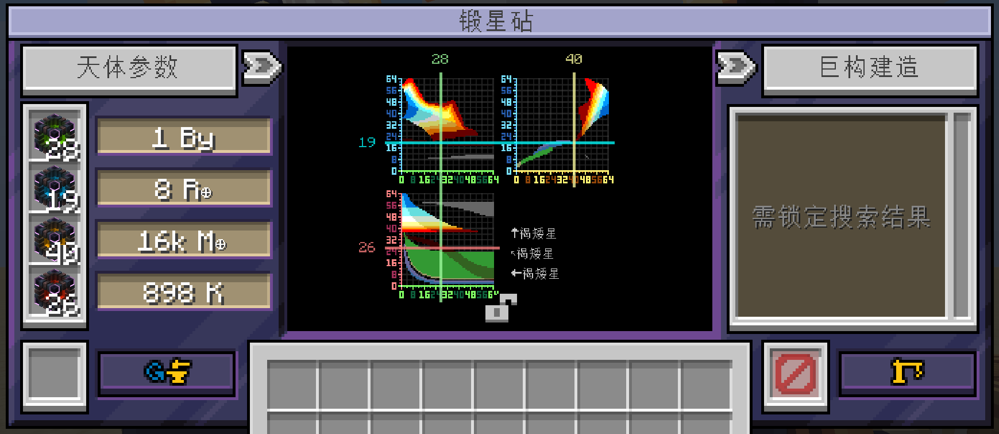

---
navigation:
  title: "§5Celestial Forging Anvil"
  icon: "anvilcraft:celestial_forging_anvil"
items:
  - anvilcraft:celestial_forging_anvil
  - anvilcraft:celestial_forging_anvil_amplifier
---

# <ref item="anvilcraft:celestial_forging_anvil"/>

<item id="anvilcraft:celestial_forging_anvil"/>

> Crafting requires <ref item="anvilcraft:spacetime_supercomputer"/> and <ref item="anvilcraft:mass_energy_inverter"/>

- Obtained through [Multi-block Crafting](210_giant_anvil.md#2-multi-block-crafting)
- Requires 3x2x3 space to place
- Can create celestial bodies, including stars and planets, to obtain resources

# Forging Celestial Bodies

- Use <ref item="anvilcraft:confined_time_anvilon"/>, <ref item="anvilcraft:confined_space_anvilon"/>, <ref item="anvilcraft:confined_mass_anvilon"/>, <ref item="anvilcraft:confined_energy_anvilon"/> placed on the left side in sequence, and configure reasonable parameters to search for and forge a celestial body
- Forging celestial bodies does not consume Anvilons

<tip>
Debugging parameters:
  - Use the **mouse wheel** to conveniently adjust the four parameters
  - After placing some Anvilons, hover over other Anvilon items to display the matching Anvilon count (will not display if previously placed Anvilons already cannot satisfy the condition)
</tip>

> The parameters in the image can be used to forge a brown dwarf

## Forging Planets

1. Use the four Anvilons to control the four parameters, making the **intersection** of <color=#bf6060>energy</color> and <color=#78bf78>time</color> AND the **intersection** of <color=#00bfbf>space</color> and <color=#bfbf78>mass</color> fall on the same color region
2. The text at the bottom right shows what celestial body each of the three focus areas corresponds to. As long as the first and third lines show the same celestial body, it works
3. Click the forge button. Forging takes 10s and consumes 1 MW of power, after which it no longer consumes power

## Forging Stars

<structure id="../../structures/forging_stars.nbt"/>

1. To forge a star, first prepare four <ref item="anvilcraft:celestial_forging_anvil_amplifier"/> and place them at the four corners of the <ref item="anvilcraft:celestial_forging_anvil"/>
2. Use the four Anvilons to control the four parameters, ensuring all **three focus areas** of the four lines fall on the same color region
3. Click the forge button. Forging takes 10s and consumes 32 MW of power, after which it no longer consumes power

<info>
When amplifiers are installed, forging a planet will also cost 32 MW of power
</info>

<recipe id="anvilcraft:item_inject/celestial_forging_anvil_amplifier"/>

> Crafting requires <ref item="anvilcraft:spacetime_supercomputer"/>

For more information, see [Celestial Types](../001_feature/401_celestial_type.md)

# Celestial Body & World Interaction

- After forging, the forged celestial body will appear in the *binding ring*
- Gravity will appear around it. Any creatures, items, projectiles, etc. entering the gravity field will be attracted to the celestial body and take damage
- Applying a **redstone signal** to the <ref item="anvilcraft:celestial_forging_anvil"/> can amplify the celestial body, and its gravity field will also scale up

# Extracting Celestial Resources

## Building Mega Structures

1. Click the bind button at the bottom of the <ref item="anvilcraft:celestial_forging_anvil"/> GUI
2. On the right side of the <ref item="anvilcraft:celestial_forging_anvil"/> GUI, select *Mega Structure* and submit the corresponding **building materials**

For construction requirements, crafting methods, materials, and functional descriptions, see [Mega Structures](402_mega_structure.md).

<tip>
To remove a mega structure, simply unbind and rebind the planet
</tip>

## Logistics Interaction

- Input raw materials and extract resources through various interfaces ([click here](402_interface.md) for details)

# Stellar Evolution

- Using [Stellar Evolution Accelerator](402_mega_structure.md#stellar-evolution-accelerator) can accelerate the aging of stars
- Some stars will ultimately trigger a *supernova explosion*, destroying all of their *mega structures* and causing a massive explosion that reaches over ten blocks away
- All stars become *stellar remnants* at the end of their life

<info>
During acceleration, if a *Dyson Sphere* exists, it will collect **infinite electrical energy**
</info>

## Stellar Remnants

The original star's mass determines what type of stellar remnant it becomes

| Mass Anvil Count | Stellar Remnant |
|:----------------:|:---------------:|
|      [1,54]      |   White Dwarf   |
|     [55,58]      |  Neutron Star   |
|     [59,64]      |   Black Hole    |

# Seed Items

Certain consumable items can be placed in the bottom-left corner of the GUI to grant special effects to celestial forging.

## Mineral Enrichment

Raw ores can increase the yield and proportion of the corresponding mineral resources on searched celestial bodies.

## Hidden Celestial Bodies

### Overworld Like

Use <ref item="minecraft:grass_block"/> as a *seed item*.
Set the Anvilon counts to: time 32, space 14, mass 20, energy 16.

You can land on this planet using <ref item="anvilcraft:celestial_forging_anvil_portal"/>.

### ■esh P■n■

> There s■■■s to be ■n■■■■■tion here, but it has been ■■a■■■ by ■■■■

# Identical Celestial Bodies

- Right-click <ref item="anvilcraft:celestial_forging_anvil"/> with <ref item="anvilcraft:disk"/> to copy the celestial body data
- Place this <ref item="anvilcraft:disk"/> into the *seed item* slot of another celestial forging anvil, consuming the <ref item="anvilcraft:disk"/> to forge another celestial body with the exact same parameters — they become *Identical Celestial Bodies*
- For extreme celestial bodies (neutron stars, black holes), use <ref item="anvilcraft:singularity_crystal"/> as the medium instead to complete the forging

# Amplifying Celestial Bodies

Apply a redstone signal to <ref item="anvilcraft:celestial_forging_anvil"/> to amplify the celestial body

Every 3 levels of redstone signal, the rendered size of the celestial body doubles
