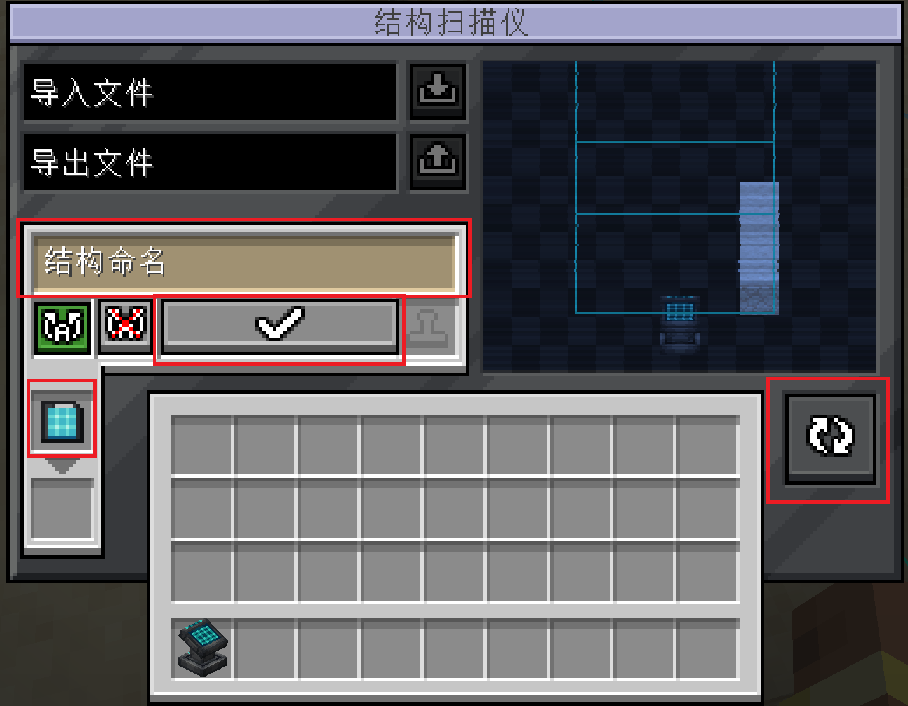

---
navigation:
  title: "§2结构扫描仪"
  icon: "anvilcraft:structure_scanner"
items:
  - anvilcraft:structure_scanner
  - anvilcraft:structure_disk
---

# 结构磁盘

<row halign="center">
<recipe id="anvilcraft:disk_to_structure_disk"/>
<recipe id="anvilcraft:disk"/>
</row>

- 可以存储结构
- 可用于<ref item="anvilcraft:smart_block_placer"/>的蓝图模式

> 有点像 U盘

# 结构扫描仪

<recipe id="anvilcraft:structure_scanner"/>

用于扫描和保存结构

## 手动保存

打开 GUI：

1. 点击**右侧**按钮开始扫描结构
2. 放入<ref item="anvilcraft:structure_disk"/>
3. 输入结构名字（可选）
4. 点击**确认记录结构**按钮保存

## 自动保存

1. <ref item="anvilcraft:structure_disk"/>可以通过溜槽等物流方块输入输出
2. 收到红石信号后执行保存

---

## 导入导出功能

1. 导入和导出作用于同一文件夹，该文件夹位于**世界文件夹**下；在服务器上，文件操作需要**管理员权限**
2. 可以设置该结构是否允许自动旋转，以免有方向要求的机器被放反

<info>
具体操作涉及世界存储（可理解为云端）、<ref item="anvilcraft:structure_scanner"/>的存储（可理解为本地电脑）和<ref item="anvilcraft:structure_disk"/>的存储（可理解为 U 盘）。
</info>

### 导出（上传）结构

#### 将<ref item="anvilcraft:structure_scanner"/>的内容上传到世界

1. 扫描结构，使扫描仪保存结构；此时可在右侧屏幕中看到影像
2. 填写上传文件的名称，点击**导出结构**按钮

#### 将<ref item="anvilcraft:structure_disk"/>的内容上传到世界

1. 让扫描仪内没有已保存的结构，或仅扫描到空气
2. 放入**已记录结构的**<ref item="anvilcraft:structure_disk"/>
3. 填写上传文件的名称，点击**导出结构**按钮

#### 从世界下载结构

1. 输入要导入文件的名称，点击**导入结构**按钮；导入的结构会暂存到<ref item="anvilcraft:structure_scanner"/>中
2. 再放入<ref item="anvilcraft:structure_disk"/>，即可将结构从<ref item="anvilcraft:structure_scanner"/>保存到<ref item="anvilcraft:structure_disk"/>
