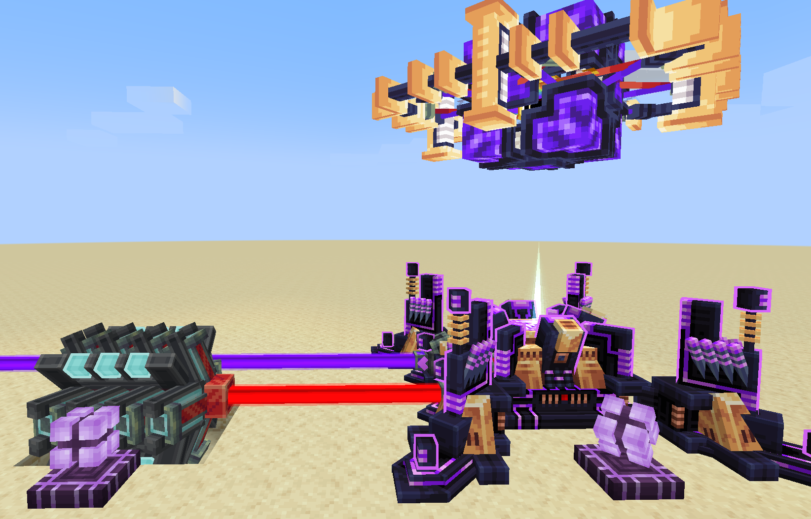

---
navigation:
  title: "§5锻星砧：巨构"
  icon: "anvilcraft:celestial_forging_anvil_logistics_interface"
items:
  - anvilcraft:dyson_sphere_component
  - anvilcraft:penrose_sphere_component
  - anvilcraft:wormhole_stabilizer_component
  - anvilcraft:matter_decompressor_component
  - anvilcraft:stellar_ring_component
  - anvilcraft:magnetar_coil_component
  - anvilcraft:stellar_evolution_accelerator_component
---

# 巨构

巨构用于从锻造完成的天体中提取资源、发电或改变天体状态

# 合成巨构

- 在<ref item="anvilcraft:celestial_forging_anvil"/>中锻造并绑定符合条件的天体，再在 GUI 右侧选择目标巨构并提交对应的**合成材料**，即可完成建造
- 通常一颗天体只能建造一个巨构

<tip>
若要移除巨构，只需解绑再绑定星球
</tip>

# 巨构分类

- 行星级巨构：只能在未装载<ref item="anvilcraft:celestial_forging_anvil_amplifier"/>的锻星砧中建造
- 恒星级巨构：只能在装载四个<ref item="anvilcraft:celestial_forging_anvil_amplifier"/>、处于*增幅状态*的锻星砧中建造

## 星球开采器

- **建造条件**：大型卫星或岩石行星
- **合成方式**：在锻星砧的巨构页选择星球开采器并提交材料
- **合成材料**：<ref item="anvilcraft:ruby_prism"/> × 16
- **输入**：16 级[激光](201_basic_laser.md#激光)
- **输出**：行星矿物资源
- **输出效率**：每束激光输出 20个/s 物品，均分给所有连接的<ref item="anvilcraft:celestial_forging_anvil_logistics_interface"/>
- **特性**：
  - 最多可从四个方向向<ref item="anvilcraft:celestial_forging_anvil_laser_interface"/>输入激光，获得最高 4 倍采集效率；每个接口只提供 1 倍效率，即使输入 64 级激光也是如此
  - 如果输入*伽马激光*会直接炸碎星球

## 行星抽取器

- **建造条件**：存在**液体**的岩石行星
- **合成方式**：在锻星砧的巨构页选择行星抽取器并提交材料
- **合成材料**：<ref item="anvilcraft:pump"/> × 16
- **输入**：无
- **输出**：行星流体资源
- **输出效率**：每个连接的<ref item="anvilcraft:celestial_forging_anvil_fluid_interface"/>**各自**输出 5B(桶)/s 流体

## 生态站

- **建造条件**：存在**生物资源**的岩石行星
- **合成方式**：在锻星砧的巨构页选择生态站并提交材料
- **合成材料**：<ref item="anvilcraft:tempering_glass"/> × 64
- **输入**：持续耗电 1 MW
- **输出**：行星生物资源中的物品和流体
- **输出效率**：
  - 输出 20个/s 物品，均分给所有连接的<ref item="anvilcraft:celestial_forging_anvil_logistics_interface"/>
  - 每个连接的<ref item="anvilcraft:celestial_forging_anvil_fluid_interface"/>**各自**输出 5B(桶)/s 流体

## 神殿

- **建造条件**：存在**低等文明**的岩石行星
- **合成方式**：在锻星砧的巨构页选择神殿并提交材料
- **合成材料**：<ref item="anvilcraft:enchanted_gold_block"/> × 64
- **输入**：作为神明恩赐或天罚的特定物品
- **输出**：文明的供奉
- **特性**：神殿每天会刷新一次物品需求，并按两次恩赐、一次天罚的顺序循环输入物品后，文明会持续供奉至下一个 MC 日的凌晨；

<tip>
不建议在夜晚提供物品，否则需要在不久后（也就是第二天凌晨）再次给予恩赐或天罚
</tip>

## 巨行星抽取器

- **建造条件**：气巨星或冰巨星
- **合成方式**：在锻星砧的巨构页选择巨行星抽取器并提交材料
- **合成材料**：<ref item="anvilcraft:pump"/> × 32
- **输入**：无
- **输出**：巨行星资源中的物品和流体
- **输出效率**：
  - 输出 20个/s 物品，均分给所有连接的<ref item="anvilcraft:celestial_forging_anvil_logistics_interface"/>
  - 每个连接的<ref item="anvilcraft:celestial_forging_anvil_fluid_interface"/>**各自**输出 5B(桶)/s 流体
- **特性**：必须先收集流体，才能同时将物品资源抽取出来

## 戴森球

<recipe id="anvilcraft:dyson_sphere_component"/>

- **建造条件**：褐矮星或普通恒星
- **合成方式**：在锻星砧的巨构页选择戴森球并提交材料
- **合成材料**：褐矮星需要<ref item="anvilcraft:dyson_sphere_component"/> × 8；小型恒星需要<ref item="anvilcraft:dyson_sphere_component"/> × 16；大型恒星需要<ref item="anvilcraft:dyson_sphere_component"/> × 32
- **输入**：无
- **输出**：持续发电，发电量与天体的*温度*和*半径*正相关

### 原始物质增幅

- 褐矮星戴森球可以消耗流体接口中的原始物质增强自身的发电能力，供给越多，发电越多——到2B/t时发电量增幅达到5倍（上限）
- 褐矮星收到的供给超过 2B/t ，多余的部分将逐渐转为褐矮星的质量，累计 12800B 后褐矮星将变为特殊的红矮星，该特殊恒星不需要*增幅器*
- 部分小型恒星+戴森球也可以消耗原始物质增加发电量：
  - 红矮星固定每gt2B：发电量×2（包括由褐矮星变为的红矮星）
  - 橙矮星固定每gt2B：发电量×1.5
  - 黄矮星固定每gt2B：发电量×1.25

<tip>
天体会一次吞掉<ref item="anvilcraft:celestial_forging_anvil_fluid_interface"/>中的所有原始物质，考虑使用<ref item="anvilcraft:control_valve"/>限速
</tip>

## 星环对撞机

<recipe id="anvilcraft:stellar_ring_component"/>

- **建造条件**：小型恒星
- **合成方式**：在锻星砧的巨构页选择星环对撞机并提交材料
- **合成材料**：<ref item="anvilcraft:stellar_ring_component"/> × 8
- **输入**：持续耗电 4 MW，并通过物流接口输入对撞原料和铁砧
- **输出**：执行[铁砧撞击合成](215_large_electromagnet.md#铁砧撞击合成)
- **特性**：
  - 配方恒星的引力和磁场越强，工作越快
  - 配方要求的速度越高，工作越慢

## 恒星演化加速器

<recipe id="anvilcraft:stellar_evolution_accelerator_component"/>

- **建造条件**：除白矮星、中子星、黑洞和特殊红矮星外的恒星
- **合成方式**：在锻星砧的巨构页选择恒星演化加速器并提交材料
- **合成材料**：<ref item="anvilcraft:stellar_evolution_accelerator_component"/> × 8
- **输入**：无
- **作用**：加速恒星演化恒星结束生命后会成为白矮星，或引发超新星爆发并产生中子星或黑洞
- **特性**：可以与其他恒星级巨构共存

### 超新星爆发

超新星爆发会摧毁该天体上的所有巨构，并产生波及十几格远的巨大爆炸

<info>
加速过程中，如果存在戴森球，它在主序星阶段会收集到**无限电能**，在巨星阶段被摧毁
</info>

## 磁星线圈

<recipe id="anvilcraft:magnetar_coil_component"/>

- **建造条件**：中子星
- **合成方式**：在锻星砧的巨构页选择磁星线圈并提交材料
- **合成材料**：<ref item="anvilcraft:magnetar_coil_component"/> × 4
- **输入**：无
- **输出**：持续发电，发电量与天体的*磁场强度*和*转速*正相关

## 虫洞稳定器

<recipe id="anvilcraft:wormhole_stabilizer_component"/>

- **建造条件**：处于增幅状态的黑洞
- **合成方式**：在锻星砧的巨构页选择虫洞稳定器并提交材料
- **合成材料**：<ref item="anvilcraft:wormhole_stabilizer_component"/> × 4
- **输入**：全同黑洞
- **输出**：[虫洞](332_teleportation.md)

## 彭罗斯球

<recipe id="anvilcraft:penrose_sphere_component"/>

- **建造条件**：黑洞
- **合成方式**：在锻星砧的巨构页选择彭罗斯球并提交材料
- **合成材料**：<ref item="anvilcraft:penrose_sphere_component"/> × 8
- **输入**：激光
- **输出**：同等级[伽马激光](../001_feature/332_gamma_laser.md)

彭罗斯球的激光输入和输出必须成组地位于锻星砧同一侧的左右两边；四个侧面的激光输入与输出彼此独立，且不能使用侧面中间的接口

> 制造[伽马激光](../001_feature/332_gamma_laser.md)

## 物质解压器

<recipe id="anvilcraft:matter_decompressor_component"/>

- **建造条件**：中子星或黑洞
- **合成方式**：在锻星砧的巨构页选择物质解压器并提交材料
- **合成材料**：<ref item="anvilcraft:matter_decompressor_component"/> × 2
- **输入**：*伽马激光*；每级伽马激光提供 1 倍工作效率
- **输出**：
  - 中子星每 10 秒开采一次，大概率产出 1 个<ref item="anvilcraft:neutronium_ingot"/>，磁场强度足够高时小概率产出<ref item="anvilcraft:charged_neutronium_ingot"/>——概率与磁场强度正相关
  - 黑洞每游戏刻开采一次，大概率产出 1 个<ref item="anvilcraft:void_matter"/>，磁场强度足够高时小概率产出<ref item="anvilcraft:excited_state_void_matter"/>——概率与磁场强度正相关
