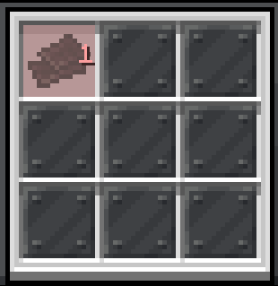

---
navigation:
  title: "§6加工：下界合金"
  icon: "minecraft:netherite_block"
---

# 加工：下界合金

以下两台机器实现了[量产下界合金](../008_recipe/210_netherite_ingot.md)

## <ref item="minecraft:ancient_debris"/>机

<structure id="../../structures/machine/ancient_debris.nbt"/>

- <ref item="anvilcraft:pulse_generator"/>设为(循环模式| 15gt | 0gt)
- 所有 <ref item="minecraft:smooth_stone"/> 可替换为 任意完整不透明方块
- 配置输出<ref item="minecraft:netherite_scrap"/>的<ref item="anvilcraft:chute"/>单次仅输出一个（使用滚轮调整数量）

## <ref item="minecraft:netherite_block"/>机

<structure id="../../structures/machine/netherite_block.nbt"/>

- <ref item="anvilcraft:pulse_generator"/>设为(循环模式| 15gt | 0gt)
- 所有 <ref item="minecraft:smooth_stone"/> 可替换为 任意完整不透明方块
